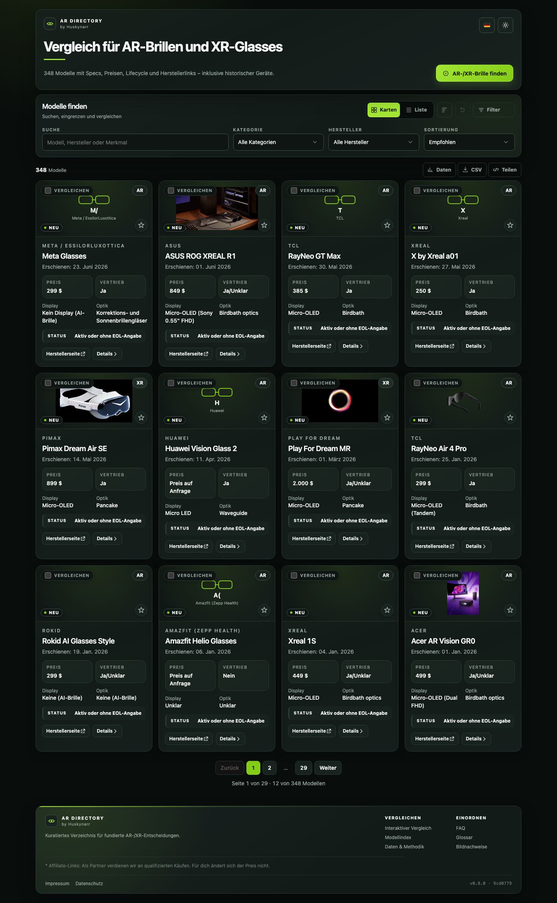

# AR/XR Brillen Vergleich

Webverzeichnis fuer AR- und XR-Brillen mit Fokus auf Vergleichbarkeit:
- Kartenansicht und tabellarische Ansicht
- Shop-Link pro Modell
- Preisstatus pro Modell
- Spezifikationen (Display, FOV, Refresh, Tracking, Compute, Software)
- Lifecycle-Infos (aktiver Vertrieb, EOL-Status, Hinweise)

## Screenshot



## Features

- Startseite zeigt alle verfuegbaren Brillen als Cards
- Umschaltbar zwischen `Cards` und `Tabelle`
- Volltextsuche (Modell, Hersteller, Software, Tracking, Display, Lifecycle-Notizen)
- Filter:
  - Kategorie (`AR` / `XR`)
  - Hersteller
  - Display-Typ
  - Optik
  - Tracking
  - Eye Tracking
  - Hand Tracking
  - Passthrough
  - aktiver Vertrieb
  - Preset `Nur aktiv im Vertrieb` fuer schnellen Fokus auf verfuegbare Modelle
  - explizite `AR-Flag` und `XR-Flag` Toggle
  - EOL/Update-Status
  - minimaler horizontaler Winkel (FOV)
  - minimale Refresh-Rate
  - maximaler Preis (USD)
  - nur mit Preis
  - nur mit Shop-Link
- Sortierung:
  - Name, Hersteller, Neueste, Preis, FOV
- Sprache:
  - DE/EN Umschaltung per UI-Button
  - persistiert in LocalStorage und URL-Parameter `lang`
- Teilen:
  - URL-sharebar (Filter, Sortierung und Compare-Auswahl koennen direkt geteilt werden)
- Vergleich:
  - Multi-Select mit bis zu 6 Modellen
  - Compare-Modus mit direkter Merkmalsmatrix
  - Radar-Chart fuer schnellen visuellen Modellvergleich
- Ansichtsoptionen:
  - `EUR-Zusatz` nutzt einen Live-EUR-Kurs zur USD-Umrechnung
  - `Unbekannte Werte ausblenden` reduziert Rauschen in Listen und Compare-Ansicht
  - `Hellmodus`/`Dunkelmodus` (huskynarr-inspiriert), persistent per LocalStorage und URL-Parameter `theme`
- Kartenansicht:
  - initial 12 Cards und `Mehr laden` Pagination
- Karten enthalten:
  - Bild, Name, Hersteller, Kategorie
  - Preis, Vertrieb, Lifecycle/EOL
  - Display, Optik, FOV, Refresh, Aufloesung
  - Software, Compute Unit, Tracking, Eye/Hand/Passthrough
  - Shop-Link + Datenquelle

## Datenabdeckung

- Enthalten sind AR-Modelle plus XR-Brillen (Display-/Smart-Glasses-Kategorie)
- Legacy-Modelle sind explizit enthalten, z. B.:
  - Microsoft HoloLens 1
  - Epson Moverio BT-200
  - Sony SmartEyeglass (SED-E1)
  - Recon Jet
  - Vuzix M100
- Aktueller Datensatzstand: `public/data/ar_glasses.metadata.json`

## Tech Stack

- Vite
- Tailwind CSS (via `@tailwindcss/vite`)
- Vanilla JavaScript
- Papa Parse (CSV Parsing)

## Datenquelle

Die Datengrundlage ist ein kuratierter lokaler Datensatz (aktuell **347 Modelle**, inkl. globaler und chinesischer Markt bis Juni 2026):
- Generator: `scripts/generate-ar-csv.mjs` — normalisiert die CSV und erzeugt daraus **alle** abgeleiteten Artefakte (Metadaten, JSON-LD-Strukturdaten, Sitemap, llms.txt, llms-full.txt, ai-search.json). Die CSV ist damit die einzige Quelle der Wahrheit.
- Recherche-Enrichment: `scripts/apply-enrichment.mjs` — spielt einen Recherche-Payload (`scripts/enrichment-2026.json`: Feld-Aenderungen + neue Geraete inkl. Quellenangaben) in die CSV ein; danach `npm run data:generate` ausfuehren.
- Herstellerbild-Enrichment: `scripts/enrich-manufacturer-images.mjs`
- Ausgabe (alle aus der CSV generiert):
  - `public/data/ar_glasses.csv`
  - `public/data/ar_glasses.metadata.json` (inkl. Feld-Abdeckung, Preisspanne, Kennzahlen)
  - `public/data/structured-data.json`
  - `public/sitemap.xml`, `public/llms.txt`, `public/llms-full.txt`, `public/ai-search.json`
- Bilddarstellung:
  - Primar werden `image_url`-Eintraege aus offiziellen Herstellerseiten genutzt.
  - Fuer technisch instabile Legacy-Quellen werden originale Herstellerbilder lokal gespiegelt unter `public/images/manufacturers/`.
  - Das Enrichment nutzt zusaetzlich kuratierte Modell-Overrides und markeninterne Fallbacks, falls einzelne Produktseiten technisch nicht mehr erreichbar sind.
  - Falls kein valides Herstellerbild gefunden wird, zeigt die UI eine lokale SVG-Fallback-Visualisierung.

## SEO & LLM Discovery

Fuer bessere Auffindbarkeit in Suchmaschinen und LLM-basierten Suchsystemen sind enthalten:
- HTML-Meta-Optimierung in `index.html`:
  - Title/Description/Robots inkl. dynamischer Modellanzahl (Build-Tokens)
  - OpenGraph (mit absoluter Bild-URL, Groesse, `site_name`, `locale:alternate`) + Twitter Cards
  - JSON-LD (`WebSite`, `CollectionPage`, `Dataset`, **`ItemList` mit allen Produkten als `Product`**)
- **Statische Einzelseiten** (aus der CSV generiert, `scripts/lib/render-pages.mjs`):
  - `public/<brand>/<model>/index.html` — eine eigenstaendige, crawlbare Detailseite pro Modell unter sprechender URL (z. B. `/xreal/one-pro/`) mit allen Specs, Lifecycle, JSON-LD `Product` + `BreadcrumbList`, interner Verlinkung (Hersteller/Kategorie) und Deep-Links in die Vergleichs-App. Alte `public/modelle/<slug>.html` bleiben als Redirect-Stubs (canonical + Meta-Refresh) erhalten.
  - `public/modelle/index.html` — A–Z-Modell-Hub gruppiert nach Hersteller
  - `public/glossar.html` — Glossar + FAQ mit JSON-LD `FAQPage` + `DefinedTermSet`
- Build-Time-Injektion via Vite-Plugin (`vite.config.js`):
  - injiziert die generierten JSON-LD-Strukturdaten in das HTML
  - rendert einen **statischen, crawlbaren Katalog** aller Modelle in `#app` (zur Laufzeit von der SPA ersetzt, verlinkt auf die Einzelseiten) — so sehen Suchmaschinen und JS-lose AI-Crawler den vollen Datenbestand
- Crawl-Dateien (aus der CSV generiert, siehe Datenquelle):
  - `public/robots.txt` (inkl. expliziter Allow-Regeln fuer GPTBot, ClaudeBot, PerplexityBot, Google-Extended u. a.)
  - `public/sitemap.xml`, `public/llms.txt`, `public/llms-full.txt`, `public/ai-search.json`, `public/data/structured-data.json`
- PWA:
  - `public/manifest.json` (mit Icons, Screenshots, Kategorien) und gebrandetes `public/icon.svg`
- OpenGraph-Bild:
  - `public/og/startseite.png`

Die produktive Basis-URL ist `https://ardirectory.huskynarr.de/` und wird zentral in `scripts/generate-ar-csv.mjs`
(`BASE_URL`) gepflegt; alle generierten Artefakte (sitemap, llms, ai-search, structured-data, Einzelseiten) sowie
`index.html` und `public/robots.txt` nutzen sie. Bei einem Domainwechsel `BASE_URL` anpassen, `npm run data:generate`
ausfuehren und die absoluten URLs in `index.html`/`robots.txt` ersetzen. (`source_page` = `https://huskynarr.de/`
bleibt als Autoren-/Markenangabe davon unberuehrt.)

## Affiliate / Monetarisierung

Affiliate-Scaffolding ist vorhanden, aber **standardmaessig deaktiviert** (`AFFILIATE.enabled = false`
in `src/affiliate.js`) — es werden erst Kauf-Buttons + Disclosure ausgespielt, wenn alles konfiguriert ist.

Unterstuetzt: **Amazon.de, Amazon.com, eBay, Otto, idealo** (Otto/idealo via AWIN). Pro Geraet wird ein
getaggter **Such-Link** automatisch erzeugt; kuratierte **Produkt-Deeplinks** koennen in
`public/data/affiliate-overrides.json` (Key = CSV-`id`) hinterlegt werden und haben Vorrang. Alle
Affiliate-Links erhalten `rel="sponsored nofollow noopener"` + `target="_blank"`. Buttons erscheinen in
Karten, Detail-Modal und auf den statischen Detailseiten.

**Aktivierung:**
1. In `src/affiliate.js` die `CHANGEME-*`-Partner-IDs durch echte ersetzen (Amazon-Tags, eBay `campid`,
   AWIN `awinMid`/`awinAffid`).
2. `public/impressum.html` und `public/datenschutz.html` (generierte Vorlagen) — `[PLATZHALTER]` ausfuellen
   und rechtlich pruefen lassen.
3. Partner der jeweiligen Programme sein (Amazon PartnerNet, eBay Partner Network, AWIN).
4. `AFFILIATE.enabled = true` setzen, `npm run data:generate` + `npm run build`.

## Lokale Entwicklung

Voraussetzungen:
- Node.js 20+
- npm

Installation:

```bash
npm ci
```

Entwicklung starten:

```bash
npm run dev
```

Produktions-Build:

```bash
npm run build
```

Build lokal pruefen:

```bash
npm run preview
```

Datensatz + alle SEO/LLM-Artefakte neu generieren:

```bash
npm run data:generate
```

Recherche-Enrichment einspielen (Feld-Updates + neue Geraete) und danach regenerieren:

```bash
npm run data:enrich   # liest scripts/enrichment-2026.json
npm run data:generate
```

Herstellerbilder aus offiziellen Seiten neu anreichern:

```bash
npm run images:enrich
```

## Projektstruktur

```text
.
├─ public/
│  ├─ data/
│  │  ├─ ar_glasses.csv            # Quelle der Wahrheit (40 Spalten)
│  │  ├─ ar_glasses.metadata.json  # generiert
│  │  └─ structured-data.json      # generiert (JSON-LD)
│  ├─ modelle/                     # generiert: <slug>.html pro Modell + index.html
│  ├─ glossar.html                 # generiert (Glossar + FAQ)
│  ├─ images/manufacturers/
│  ├─ icon.svg                     # PWA/Favicon
│  ├─ manifest.json · sw.js · robots.txt
│  └─ sitemap.xml · llms.txt · llms-full.txt · ai-search.json   # generiert
├─ scripts/
│  ├─ generate-ar-csv.mjs          # CSV -> alle Artefakte + statische Seiten
│  ├─ lib/render-pages.mjs         # Pro-Gerät-/Index-/Glossar-HTML
│  ├─ apply-enrichment.mjs         # Recherche-Payload -> CSV
│  ├─ enrichment-2026.json         # Recherche-Payload (Specs + neue Geraete, mit Quellen)
│  ├─ enrichment-phase2.json       # Recherche-Payload (Tiefen-Specs, mit Quellen)
│  └─ enrich-manufacturer-images.mjs
├─ src/
│  ├─ main.js                      # Orchestrator (render-Loop, Events, init)
│  ├─ state.js · i18n.js · seo.js · actions.js
│  ├─ data/   (dataset.js, model.js, filters.js)
│  ├─ render/ (cards, table, compare, modal, image, shared, stats, registry)
│  ├─ utils.js
│  └─ style.css
├─ docs/
│  └─ screenshots/
│     └─ startseite.png
├─ .gitlab-ci.yml
├─ .node-version
├─ CONTRIBUTING.md
├─ LICENSE
├─ vite.config.js
└─ README.md
```

## CI / GitLab Pipeline

Die `.gitlab-ci.yml` enthaelt zwei Jobs:
- `verify:data`: prueft, ob Daten generiert werden koennen und die Exportdateien existieren
- `build:app`: baut die App mit Vite und speichert `dist/` als Artefakt

Damit sind Datenvalidierung und Build in CI abgedeckt.

## Deployment (Plesk)

Wenn Plesk das Repository direkt zieht, ist der uebliche Ablauf:
- Repository in Plesk verbinden und Auto-Deployment aktivieren
- Node-Version festlegen:
  - Im Repo liegt `.node-version` mit `24` fuer `nodenv`.
- Als Deployment Action auf dem Plesk-Host ein robustes Script verwenden (non-interactive shell + nodenv):

```bash
set -euo pipefail

export NODENV_ROOT="$HOME/.nodenv"
export PATH="$NODENV_ROOT/bin:$NODENV_ROOT/shims:$PATH"
if command -v nodenv >/dev/null 2>&1; then
  eval "$(nodenv init -)"
fi

# sicherstellen, dass im Repo gearbeitet wird
cd /var/www/vhosts/huskynarr.de/ardirectory.huskynarr.de

node -v
npm -v
npm ci
npm run build

# Dist in Docroot kopieren (Pfad bei Bedarf anpassen)
rsync -a --delete dist/ /var/www/vhosts/huskynarr.de/ardirectory.huskynarr.de/httpdocs/
```

- Falls `nodenv` nicht verwendet wird, alternativ absolute Node/NPM-Binaries aus einer installierten Version nutzen
  (z. B. `$HOME/.nodenv/versions/24/bin/node` und `$HOME/.nodenv/versions/24/bin/npm`).
- Optional fuer SPA-Routing (nur falls direkte Unterseiten-URLs 404 liefern) `.htaccess` im Docroot hinterlegen:

```apacheconf
<IfModule mod_rewrite.c>
  RewriteEngine On
  RewriteBase /
  RewriteRule ^index\.html$ - [L]
  RewriteCond %{REQUEST_FILENAME} !-f
  RewriteCond %{REQUEST_FILENAME} !-d
  RewriteRule . /index.html [L]
</IfModule>
```

## Contributing

Details fuer Contributions stehen in [`CONTRIBUTING.md`](CONTRIBUTING.md).

## License

Dieses Projekt steht unter der MIT-Lizenz. Siehe [`LICENSE`](LICENSE).
